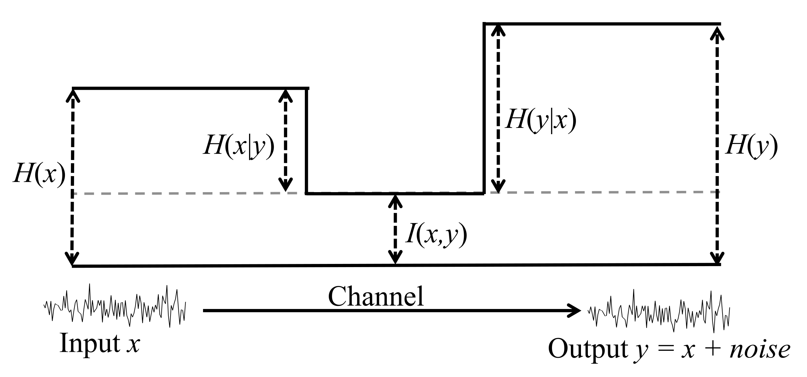

<script type="text/x-mathjax-config">
    MathJax.Hub.Config({
      tex2jax: {
        skipTags: ['script', 'noscript', 'style', 'textarea', 'pre'],
        inlineMath: [['$','$']]
      }
    });
</script>
<script src="https://cdn.mathjax.org/mathjax/latest/MathJax.js?config=TeX-AMS-MML_HTMLorMML" type="text/javascript"></script>


***
# 主要内容
1. 无监督分箱（*Unsupervised Binning*）
2. 互信息熵计算（*Mutual Infomation Entropy*）
3. 时滞相关性分析（*Time-delayed Correlation Analysis*）

***
## 1. &ensp; 无监督分箱
数据分箱是一种将多个连续值分组为较少数量的“分箱”的方法，其意义在于：  
* 统计需要
* 减少次要观测误差的影响
* 离散特征的增加和减少都很容易，易于模型的快速迭代
* 特征离散化，降低模型过拟合风险，增加模型鲁棒性

数据分箱按照有无标签可以分为有监督分箱和无监督分箱两类方法，常见的有监督分箱有：
* 卡方分箱
* KS分箱

无监督分箱有：
* 等频分箱
* 等距分箱

在本项目中，我们会选择使用无监督分箱对时间序列样本进行统计。

### 1.1 &ensp; 一维序列分箱    
我们在*unsupervised_data_binning.series_binnging*中提供了对一维序列进行无监督分箱的方法。首先，初始化一个*SeriesBinning*对象：

```
binning = SeriesBinning(x, x_type)
```

其中，*x*为时间序列, 可以为list也可以是np.ndarray对象，程序将自动将其转换为一维np.ndarray数组：  

```
self.x = np.array(x).flatten()  # flatten处理
```

参数*x_type*表示序列*x*中值的类型，为连续数值型“continuous”或离散类别型“discrete”:

```
if x_type not in VALUE_TYPES_AVAILABLE:
  raise ValueError('Param x_type {} not in value_types_availabel = {}.'.format(x_type, VALUE_TYPES_AVAILABLE))
```  

其中*SeriesBinning*对象初始化后便会获得属性*stat_params*以记录序列x的均值、标准差、中位数、上下四分位数等统计参数，以作后用。  
接下来便可对*x*进行分箱操作了，可以调用如下接口实现：  

```
freq_ns, labels = self.isometric_binning(bins)                    # 等距分箱
freq_ns, labels = self.quasi_chi2_binning(init_bins, final_bins)  # 拟卡方分箱
freq_ns, labels = self.label_binning()                            # 根据类别标签进行分箱
```

也可以统一调用接口实现：  

```
freq_ns, labels = self.series_binning(method, params)             # 通用接口
```  

其中*method*支持“isometric”、“quasi_chi2”和“label”，*params*对应设置如下：

```
if method == 'isometric':
  assert 'bins' in params.keys()
elif method == 'quasi_chi2':
  assert 'init_bins' in params.keys()
  assert 'final_bins' in params.keys()
elif method == 'label':
  pass
else:
  raise ValueError('Unknown method "{}"'.format(method))
```  

上述方法中，'quasi_chi2'是仿照有监督分箱的卡方分箱方法实现的。首先将序列进行细化等距分箱，然后分别比较相邻两个箱中样本密度，将样本密度差小于一定阈值的两个箱进行合并，直至满足终止条件为止。参数“init_bins”即为初始分箱个数，“final_bins”为最终分箱数的**下限**。

### 1.2 &ensp; 联合分箱
我们在*unsupervised_data_binning.joint_binning*中提供了对多维序列进行无监督分箱的方法。首先初始化*JointBinning*对象：

```
binning = JointBinning(data, value_types, methods, params)
```

其中，*data*为np.ndarray高维数组，*data*.shape = (*N*, *D*)，*N*为样本数，*D*为维数；*value_types*对应*data*中各维度上的值类型；*methods*和*params*对应各维度数据采用的分箱方式和参数，具体内容请参考上文*SeriesBinning*相关内容。
我们仿照Numpy中高维数据分箱histogramdd方法实现了对高维数据的分箱操作。区别在于Numpy中只提供了等距分箱histgram方法，而我们的分箱还可以使用其他非等距方法。  

1. 对各维度上的数据按照*methods*和*params*设置进行一维分箱，记录下各维度上分箱的*edge*和*label*
2. 在各个维度上将数据值向label进行插入, 返回插入位置
3. 将高维坐标映射到一维坐标上, 然后使用一维分箱统计样本在各一维坐标系箱子上的频率
4. 进行分箱结果的reshape操作以获得原高维空间中的分箱

整个分箱过程耗时与np.histogram相当。


***
## 2. &ensp; 互信息熵计算  
信息熵是统计学中对随机变量$x$不确定度的一种度量，不确定性越高则熵越大：
若$x$为离散变量：

$$
H(x) = -\sum_{x \in \chi}{p(x) {\rm log} \left(p(x) \right)}
$$

若$x$为连续变量：

$$
H(x) = \int_{x \in \chi} {-p(x) {\rm log} (p(x)) {\rm d}x}
$$

以下以离散变量为例讨论互信息熵的计算。对于两个随机变量$x$和$y$，其联合分布概率为$p(x,y)$，边际分布概率为$p(x)$、$p(y)$，则联合分布熵为：

$$
H(x,y) = \sum_{x \in \chi} \sum_{y \in Y} -p(x,y) {\rm log_2}(p(x, y))
$$

若$x$、$y$不相关，则:

$$
H(x) - H(x|y) = 0
$$

否则，$y$的加入会使得$x$的不确定度降低：

$$
 H(x|y) - H(x) < 0
$$

因此，如果变量$X$和$y$之间存在相关关系，则联合分布熵应小于二者边际熵之和：

$$
H(x,y) < H(x) + H(y)
$$

则互信息熵可以定义为：

$$
I(x,y) = H(x) + H(y) - H(x,y) = \sum_{x \in \chi} \sum_{y \in Y} p(x,y) {\rm log_2} { \frac{p(x,y)}{p(x)p(y)}}
$$

互信息熵$I(x,y)$即是变量$x$和$y$之间相关性强弱的一种度量。互信息熵计算原理如下：



互信息熵相关性计算有如下优点：

1. 适用于不同值类型变量间的计算
2. 适用于变量间线性或非线性相关性的计算

与第1节中的分箱方法相结合，能够较快地获得相关性计算结果。
